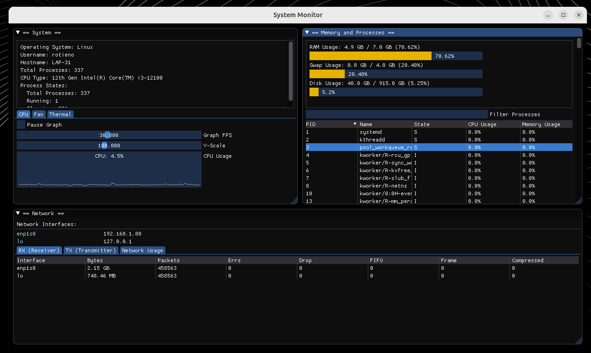

# system-monitor



A high-performance system monitoring application built with C++ and the Dear ImGui library. This project focuses on gathering real-time data from the Linux /proc virtual filesystem and displaying it through an Immediate Mode GUI.

## Features
### System Overview
- **Hardware & OS Info:** Displays OS type, current user, hostname, and CPU model.

- **Process Statistics:** Summary of task states (Running, Sleeping, Zombie, Stopped).

- **Interactive Monitoring:** Tabbed sections for CPU, Fan, and Thermal data.

  - Real-time performance graphs.

  - Controls to toggle animations and adjust graph FPS or Y-axis scaling.

## Memory & Process Management
- **Resource Visualization:** Progress bars/visual displays for RAM, SWAP, and Disk usage.

- **Process Table:** Filterable list of active processes including PID, State, CPU%, and Memory%.

- **Multi-Selection:** Support for selecting multiple process rows simultaneously.

## Network Monitor
- **Interface Tracking:** Displays IPv4 addresses for all active interfaces (e.g., lo, wlp5s0).

- **Traffic Tables:** Detailed RX (Receiver) and TX (Transmitter) statistics.

- **Smart Unit Scaling:** Automatic conversion of byte data into KB, MB, or GB for human-readable display.

## Architecture: Immediate Mode GUI
Unlike traditional Retained Mode UIs (like HTML/CSS or Qt), this app uses Dear ImGui.

- **Immediate Mode:** The UI is redrawn every frame based on the current application state.

- **Efficiency:** Minimizes state synchronization issues and is ideal for high-frequency data updates like CPU spikes.

## How to run
1. Clone repo
```bash
git clone https://github.com/Rabinnnn/system-monitor.git
```
2. Build the project
```bash
make
```
3. Run the executable
```bash
./monitor     #for linux Linux / macOS
monitor.exe   # for windows Windows

```